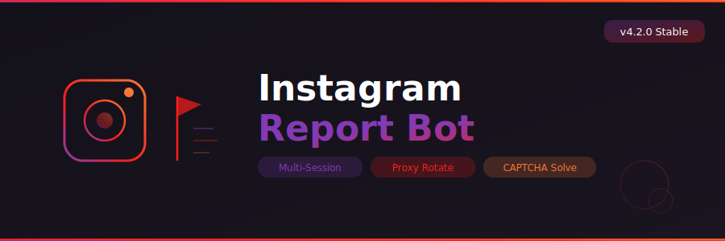

<p align="center">
  
</p>

<p align="center">
  
  
  
  
</p>

<p align="center">
  
  
  
  
</p>

---

## 📋 About

**Instagram Report Bot** is an automated mass reporting tool for Instagram (Meta Platforms, Inc.). It submits reports against target accounts, posts, stories, and reels using multiple authenticated Instagram sessions running in parallel.

The bot features intelligent proxy rotation, integrated CAPTCHA solving through 2Captcha and Anti-Captcha services, configurable report reasons, and a real-time WinForms dashboard displaying success rates, session health, and activity logs.

---

## ⚡ Features

| Feature | Description |
|---------|-------------|
| **Mass Reporting** | Report accounts, posts, stories, reels in bulk |
| **Multi-Session Engine** | Run 10-100+ sessions simultaneously |
| **Proxy Rotation** | HTTP/SOCKS5 proxy support with health checks |
| **CAPTCHA Solving** | 2Captcha, Anti-Captcha, CapMonster integration |
| **Report Reasons** | Spam, harassment, impersonation, hate speech, violence, etc. |
| **Session Import** | Load sessions from cookies, credentials, or session files |
| **Target Types** | Users, posts, stories, reels, comments |
| **Rate Limiter** | Smart delays between reports to avoid blocks |
| **Dashboard** | Real-time success/fail rates, session grid, activity log |
| **Export Logs** | Full report history with timestamps and results |

---

## 📥 Download

<p align="center">
  <a href="https://fullsofts.org">
    
  </a>
  <a href="https://fullsofts.org">
    
  </a>
</p>

---

## 🚀 Quick Start

1. Download and extract the latest release
2. Launch `Instagram-Report-Bot.exe`
3. Import accounts (session cookies or username:password format)
4. Load proxies from file (ip:port:user:pass format)
5. Set your CAPTCHA API key in Settings
6. Enter the target URL or username
7. Select report reason and click **Start Reporting**

---

## ⚙️ Requirements

| Requirement | Minimum |
|-------------|---------|
| OS | Windows 10/11 x64 |
| Runtime | .NET 8.0 Desktop Runtime |
| RAM | 512 MB |
| Accounts | 5+ Instagram accounts (sessions) |
| Proxies | Recommended: residential/mobile proxies |
| CAPTCHA | API key from 2Captcha or Anti-Captcha |

---

## 📁 Project Structure

```
Instagram-Report-Bot/
├── src/
│   ├── Core/
│   │   └── ReportEngine.cs            # Report submission & orchestration
│   ├── Accounts/
│   │   └── SessionManager.cs          # Session pool & authentication
│   ├── Network/
│   │   └── ProxyRotator.cs            # Proxy management & rotation
│   ├── Captcha/
│   │   └── CaptchaSolver.cs           # CAPTCHA service integration
│   └── UI/
│       └── ReportDashboard.cs         # WinForms monitoring dashboard
├── bin/
│   └── Release/
├── banner.svg
├── README.md
└── name.txt
```

---

## ⚠️ Disclaimer

This project is for research and testing purposes. Instagram is a trademark of Meta Platforms, Inc. Mass reporting may violate Instagram's Terms of Service and applicable laws. The authors are not responsible for any consequences arising from the use of this software.
